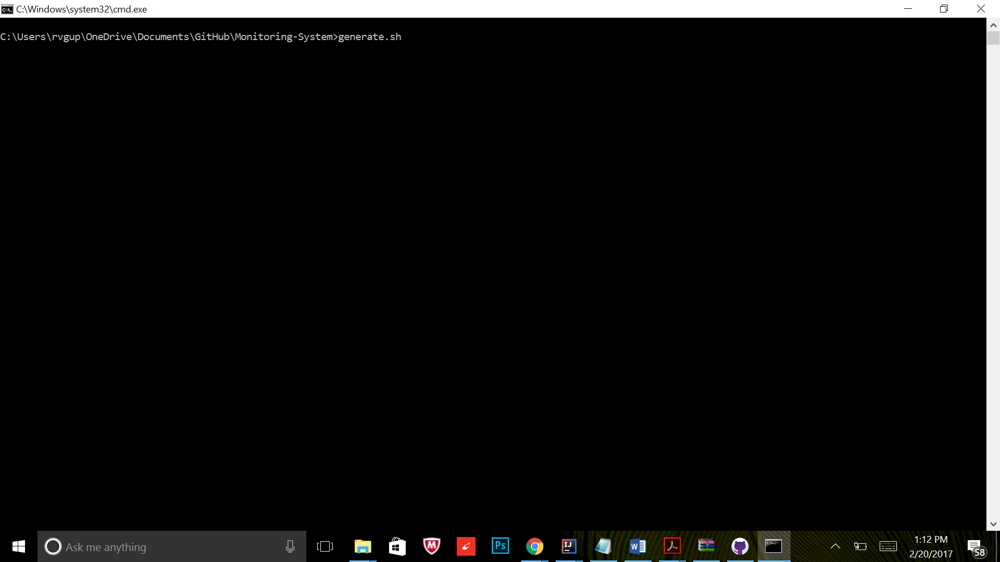
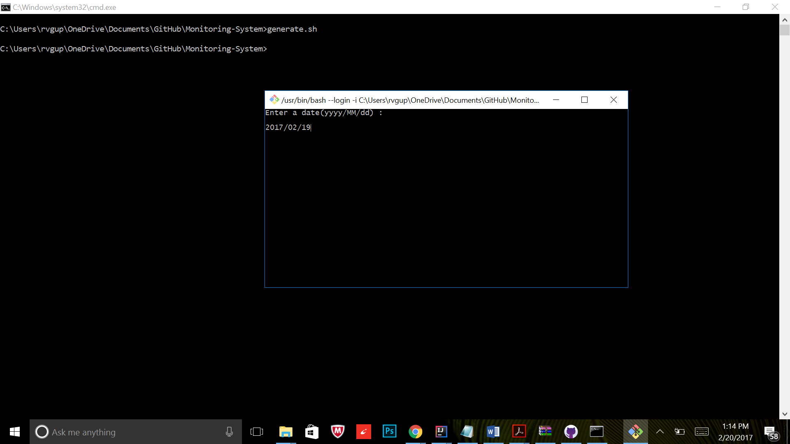
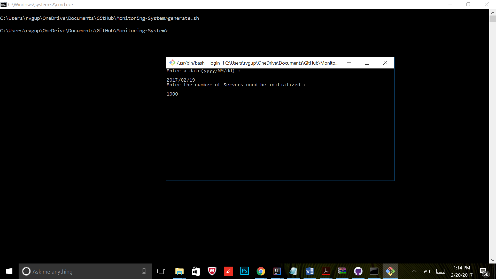
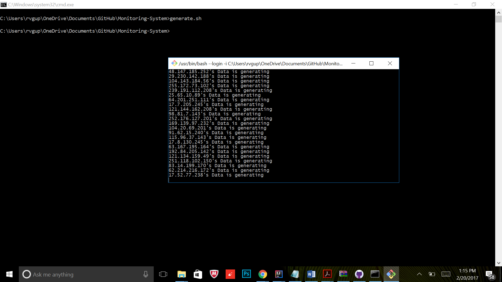
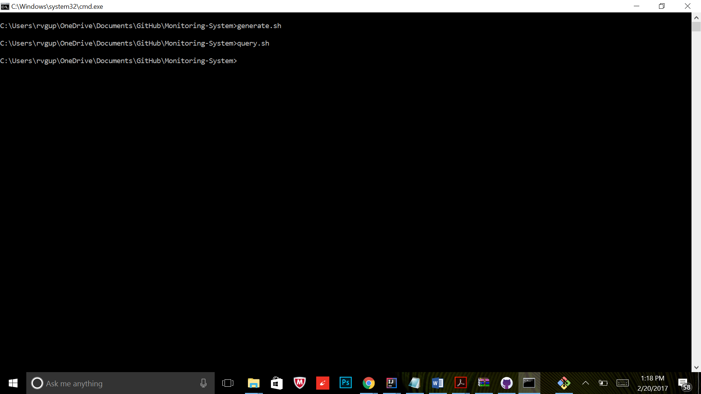
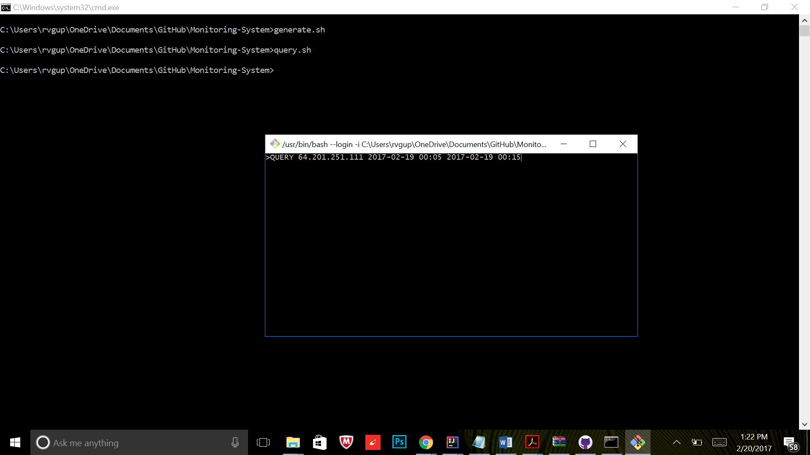
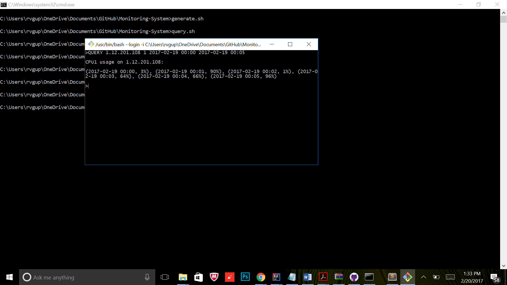
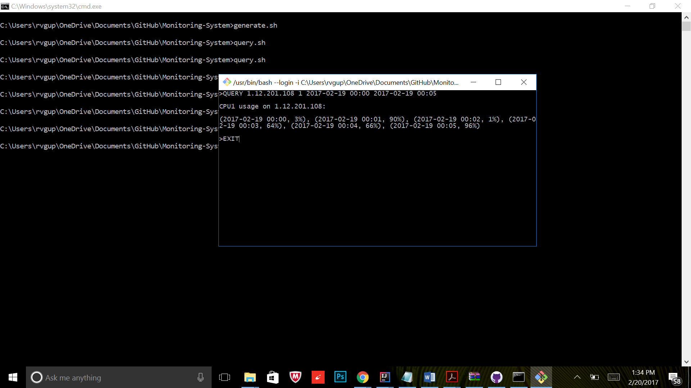

# Monitoring-System
A monitoring system, which monitors 2000 servers. Each server has 2 CPUs.
Each server generates a log for CPU usage every minute.

Jobs:

  1) Generate mock log file,

  2) Query a period time's CPU usage on ip address

## System Description

This system has two parts: 

1) log file generator

2) log file query

## Sample

1. Execute Generate command to generate random logs.

  `sh generate.sh`
  
  

2. Enter date for log generation.

  `2017/02/19`
  
  

3. Enternumber of serversto initialize.

  `1000`
  
  

4. Server initialization process running.

  

5. Execute Query command to start the interactive tool.

  `sh query.sh`
  
  

6. Use QUERY command to get CPU Usage info.
  ```
  QUERY <ip_address> <cpu_id> <start_time> <end_time>
  QUERY 10.2.34.201 1 2017-02-19 00:05 2017-02-19 00:10
  ```
  
  

7. CPU Usage Info details.
  
  

8. Use EXIT command to close the tool.

  `EXIT`
  
  
  
  ## Time taken to complete the Task
  
  It took me 1.5 hours to complete the task consisting of all the tasks involved in the challenge.
